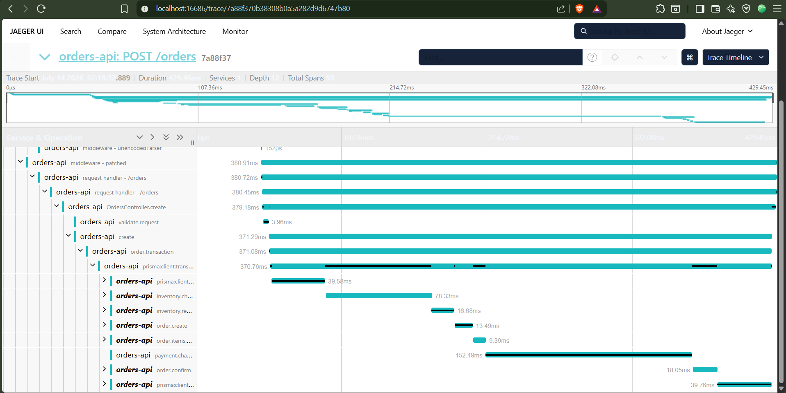

# Orders API

A small NestJS + Prisma (Postgres) Orders API. Places an order in a single database
transaction (check stock → reserve stock → create order → create items → charge → confirm),
rolling back cleanly if stock is insufficient.

Instrumented with OpenTelemetry, traces exported to Jaeger — see [Tracing](#tracing) below.

## Stack

- NestJS (TypeScript)
- Prisma 7 ORM, `@prisma/adapter-pg` driver adapter
- Postgres (via Docker Compose locally; Vercel Postgres/Neon in production)
- OpenTelemetry SDK, traces viewed in Jaeger (via Docker Compose locally; self-hosted Jaeger on
  Render in production)
- Deployed on Vercel (serverless), with CI/CD via GitHub Actions + Vercel's git integration

## Prerequisites

- Node.js
- Docker (for Postgres & Jaeger)

## Setup

1. Install dependencies:

   ```bash
   npm install
   ```

2. Copy the env template and adjust if needed:

   ```bash
   cp .env.example .env
   ```

3. Start Postgres and Jaeger:

   ```bash
   docker compose up -d
   ```

4. Apply migrations:

   ```bash
   npx prisma migrate deploy
   ```

5. Seed sample products:

   ```bash
   npx prisma db seed
   ```

6. Start the app:

   ```bash
   npm run start
   ```

   The API runs on `http://localhost:3000`.
   Interactive Swagger UI: `http://localhost:3000/docs`.

## Endpoints

| Method | Path | Description |
|---|---|---|
| `POST` | `/orders` | Place an order (transaction: check stock → reserve → create order → create items → charge → confirm) |
| `GET` | `/orders/:id` | Read an order back, including its items |
| `GET` | `/products` | List products |

Example request:

```bash
curl -X POST http://localhost:3000/orders \
  -H "Content-Type: application/json" \
  -d '{"items":[{"productId":1,"quantity":2}]}'
```

If requested quantity exceeds available stock, the transaction rolls back and the request
returns `400 Bad Request` — no partial order is ever persisted.

## Tracing

Every request is traced end-to-end with OpenTelemetry and exported to Jaeger.

1. Jaeger UI: `http://localhost:16686` (started via `docker compose up -d`, same as Postgres).
2. Make a request (e.g. `POST /orders` or `GET /products`).
3. In the Jaeger UI: select **orders-api** from the Service dropdown → **Find Traces** → click
   a trace to open the waterfall view.

Span tree for a successful `POST /orders`:

```
HTTP POST /orders              (auto)
└─ validate.request            (manual)
   └─ order.transaction        (manual — wraps the transaction)
      ├─ inventory.check       (manual) └─ db query (auto)
      ├─ inventory.reserve     (manual) └─ db query (auto)
      ├─ order.create          (manual) └─ db query (auto)
      ├─ order.items.create    (manual) └─ db query (auto)
      ├─ payment.charge        (manual — fake, small delay)
      └─ order.confirm         (manual — fake)
```

On the failure path (requesting more stock than available), `inventory.check` and
`order.transaction` both show as errored (red) spans with the exception recorded, and the
transaction rolls back — no order is persisted.

Example trace:



See `OTEL-PLAN.md` for the full step-by-step implementation plan, and `DECISIONS.md` for notes
on non-obvious choices made along the way (e.g. why some things had to be verified directly
rather than assumed from docs/tutorials).

## Deployment

Live production deployment:

- **API:** https://observability-poc.vercel.app
- **Swagger UI:** https://observability-poc.vercel.app/docs
- **Jaeger (production traces):** https://observability-poc.onrender.com

App runs on Vercel as a serverless function (`api/index.ts`), backed by a Vercel Postgres/Neon
database, with traces sent to a self-hosted Jaeger instance on Render. Local dev
(`docker-compose.yml`, local Jaeger) is unaffected and still works exactly as described above.

- **CI/CD:** pushing to `main` runs GitHub Actions (lint + test), then Vercel builds and deploys
  automatically.
- **Jaeger on Render:** `infra/jaeger-render/` — a custom Dockerfile running Jaeger plus a small
  nginx reverse proxy, needed since Render's free tier only exposes one public port but Jaeger
  needs two (OTLP ingest + UI).

See `DECISIONS.md` for the reasoning behind these choices, including why this Jaeger deployment
is deliberately ephemeral (demo-only tradeoff, not meant for real production use).

## Notes

- Postgres is mapped to host port `5433` (not the default `5432`) to avoid conflicting with
  a native Postgres install — see `DATABASE_URL` in `.env.example`.
- Prisma 7 requires a driver adapter (`@prisma/adapter-pg`) rather than reading `DATABASE_URL`
  directly at runtime; this is wired up in `src/prisma/prisma.service.ts`.
- The OTel SDK is bootstrapped in `src/tracing.ts`, imported as the first line of `src/bootstrap.ts`
  (shared by both `src/main.ts` and `api/index.ts`) — it must run before Express/Nest/Prisma are
  first required for auto-instrumentation to patch anything.
